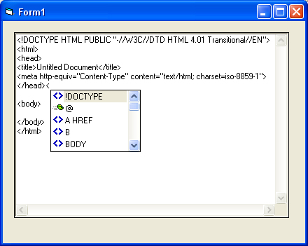



## HTML Intellisense example

### Description

The purpose is to demonstrate how to make an Intellisense control.
 
### More Info
 

             |
---                |---
**Submitted On**   |2003-01-09 20:43:38
**By**             |[Adam Ruggles](https://github.com/Planet-Source-Code/PSCIndex/blob/master/ByAuthor/adam-ruggles.md)
**Level**          |Intermediate
**User Rating**    |5.0 (45 globes from 9 users)
**Compatibility**  |VB 6\.0
**Category**       |[Custom Controls/ Forms/  Menus](https://github.com/Planet-Source-Code/PSCIndex/blob/master/ByCategory/custom-controls-forms-menus__1-4.md)
**World**          |[Visual Basic](https://github.com/Planet-Source-Code/PSCIndex/blob/master/ByWorld/visual-basic.md)
**Archive File**   |[HTML\_Intel152669192003\.zip](https://github.com/Planet-Source-Code/adam-ruggles-html-intellisense-example__1-42317/archive/master.zip)

### API Declarations

See Code

